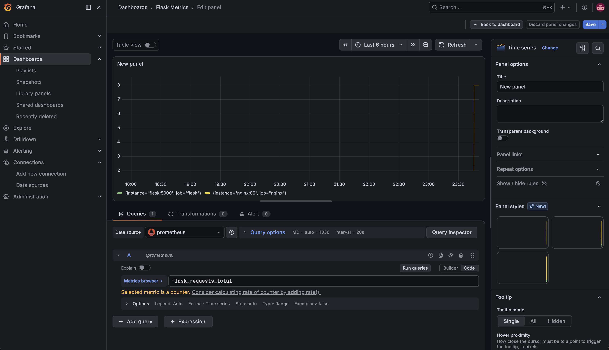

# nginx-flask

Nginx as reverse proxy in front of Flask, with Prometheus metrics and Grafana dashboards.



## Stack

Python, Flask, Nginx, Prometheus, Grafana, Docker Compose

## Architecture

Browser → Nginx (port 8080) → Flask (port 5000)
Prometheus scrapes Flask metrics every 15s → Grafana visualizes

## Run

```bash
docker compose up --build
```

- App: http://localhost:8080
- Prometheus: http://localhost:9090
- Grafana: http://localhost:3000 (admin/admin)